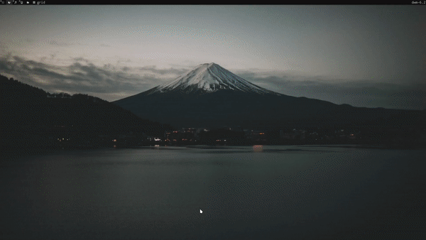

# Anime colorscripts

A script to print out images of anime to the terminal. Inspired by
[Phoney badger's pokemon colorscripts](https://gitlab.com/phoneybadger/pokemon-colorscripts) 
Which is inspired by
[DT's colorscripts compilation](https://gitlab.com/dwt1/shell-color-scripts)

## Table of contents
- [Anime colorscripts](#anime-colorscripts)
  - [Table of contents](#table-of-contents)
  - [Description](#description)
  - [Visuals](#visuals)
    - [Demo GIFs](#demo-gifs)
    - [Screenshots](#screenshots)
  - [Requirements](#requirements)
  - [Build](#build)
  - [Install](#install)
  - [Usage](#usage)
    - [Running on terminal startup](#running-on-terminal-startup)
      - [On Bash and ZSH](#on-bash-and-zsh)
      - [On Fish](#on-fish)
  - [Location of the files](#location-of-the-files)
  - [How it works](#how-it-works)
  - [Author](#author)
  - [License](#license)

## Description
Prints out colored unicode sprites of anime onto your terminal. Contains
almost 900 anime from gen 1 to gen 8. Has all the animes you could ever want
(okay it doesn't have shiny anime or different forms, but cut me some slack)

## Visuals
### Demo GIFs
Demo of the program being used

<!--  -->

Demo of the program running on terminal startup.

<!--  -->

### Screenshots


## Requirements
The program itself is just a shell script that prints out custom color formatted
text files. So as long as you have a POSIX compliant shell like dash, bash, zsh etc.
as your shell and have coreutils (might not be present on your system if using
MacOs. See installation instructions for MacOS for more details), the script should work.
You will however need a terminal with true color support, which most
modern terminals have. More on terminals and color support can be found in
[this gist](https://gist.github.com/XVilka/8346728)

## Build
Clone or download the repository
```bash
git clone https://github.com/mizuday/ani-colorscripts.git
```
`cd` into the directory and run the install script
```bash
cd anime-colorscripts
./build.sh
```
Now the program should be builded. You can install by using
```bash
sudo ./install.sh
```
Now the program should be installed. You can check this by using
```bash
anime-colorscripts
```
Which should print out the help page of the program

## Install

download 


## Usage
You can run the program from the command line to either display a anime of your
choice by specifying the anime name or make it display a random anime.
```
Usage: anime-colorscripts [OPTION] [ANIME NAME]
    "-h, --help, help" "Print this help." \
    "-l, --list, list" "Print list of all anime"\
    "-r, --random, random" "Show a random anime. This flag can optionally be
                    followed by a generation number or range (1-8) to show random
                    anime from a specific generation or range of generations.
                    The generations can be provided as a continuous range (eg. 1-3)
                    or as a list of generations (eg. 1 3 6)"\
    "-n, --name" "Select anime by name. Generally spelled like in the games.
                    a few exceptions are nidoran-f,nidoran-m,mr-mime,farfetchd,flabebe
                    type-null etc. Perhaps grep the output of --list if in
                    doubt"
```

Example of printing out a specific anime
```
anime-colorscripts -n charizard
```
Example of printing out a random anime
```
anime-colorscripts -r
```
Some anime with spaces or periods or other special characters in their name
might not be spelled as expected, some examples include:
```
farfetch'd -> farfetchd
mr.mime -> mr-mime
```
These are rare exceptions, and if required you can parse the `--list` page to see
the names of all the anime.

### Running on terminal startup
#### On Bash and ZSH
You can display a random anime whenever a terminal gets launched by adding
the `anime-colorscripts -r` command to your *.bashrc* or *.zshrc*.

#### On Fish
If you have fish as your user shell you can display a random anime on terminal
startup by overriding the `fish_greeting` in your `config.fish`
```
function fish_greeting
     anime-colorscripts -r
end
```
A more advaced setup combining multiple colorscripts can be found on anime-colorscripts#2

## Location of the files
The program is located at usr/local/opt/anime-colorscripts/ with the script being symlinked to /usr/local/bin/

## How it works
The program itself is a simple shell script that prints out text files corresponding
to the relevant anime or a randomly selected anime. The textfiles formatted with
appropriate colors can be found in the *colorscripts* folder. The sprites
were taken from [emoji.gg](https://emoji.gg/category/4/anime) and were converted into text
files using a custom python script after some preprocessing. A simple script to
scrape and download all the sprites, and a python script to convert these sprites into properly formatted and colored
text files, they are also included in the repo and can be found in the [src/generator](src/generator) folder.

## Author
Phoney badger:
https://gitlab.com/phoneybadger

## License
The MIT License (MIT)


